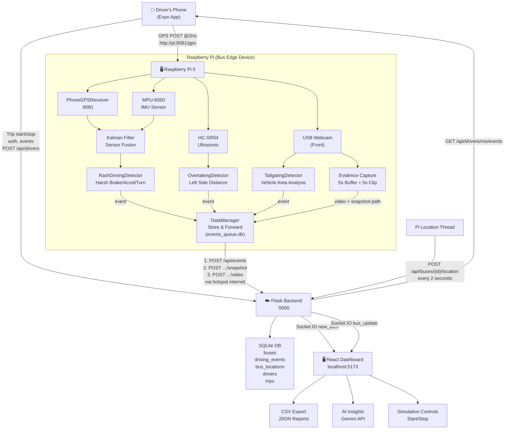

# System Workflow & Scenarios

This document describes how **OnboardRash — Rash Driving Detection System** works across all four nodes, derived directly from the codebase.

---

## 1 — Architecture Overview

```
  ┌─────────────────┐   WiFi Hotspot (2Hz GPS POST)  ┌──────────────────────┐
  │  Driver's Phone  │◄──────────────────────────────►│   Raspberry Pi 5      │
  │  (Expo App)      │   http://192.168.43.1:8081      │   (Bus Hardware)      │
  │                  │                                 │                       │
  │ expo-location    │                                 │ PhoneGPSReceiver :8081│
  │ GPS Stream       │                                 │ IMU, Ultrasonic, Cam  │
  │ Trip Management  │                                 │ DataManager (S&F)     │
  └────────┬─────────┘                                 └──────────┬────────────┘
           │                                                      │
           │  Both connect to backend via                         │
           │  phone's hotspot internet                            │
           │                                                      │
           ▼                                                      ▼
  ┌─────────────────────────────────────────────────────────────────────────────┐
  │                        Flask Backend  :5000                                 │
  │                                                                             │
  │  /api/drivers  ←── Driver app (auth, trips, events)                         │
  │  /api/events   ←── Pi (HARSH_BRAKE, TAILGATING, etc.)                       │
  │  /api/buses    ←── Pi (bus registration on startup)                         │
  │  /api/analytics ←── Dashboard (AI-powered insights via Gemini)              │
  │  /api/export   ←── Dashboard (CSV export, JSON reports)                     │
  │  WebSocket     ──► React dashboard (live alerts, bus locations)              │
  └──────────────────────────────┬──────────────────────────────────────────────┘
                                 │
                                 │ Browser
                                 ▼
                        ┌─────────────────┐
                        │  React Frontend  │
                        │  localhost:5173  │
                        │                 │
                        │  Live Map       │
                        │  Events Table   │
                        │  Dashboard      │
                        │  AI Insights    │
                        │  Settings       │
                        └─────────────────┘
```

---

## 2 — Node Responsibilities

| Node | Runs On | Key Source Files | Responsibility |
|---|---|---|---|
| **Raspberry Pi** | Pi 5 on the bus | `main_pi.py`, `data_manager.py`, `sensors/*` | Reads IMU/Ultrasonic/Camera. Receives GPS from phone. Detects rash events. Queues & uploads events (Store & Forward). Updates bus location every 2s. |
| **Driver's Phone** | Android/iOS | `services/api.ts`, `services/gpsStreamer.ts` | Streams GPS at 2 Hz via `expo-location` background task. Provides internet via WiFi hotspot. Manages trips, views score/events. |
| **Flask Backend** | Laptop/Server | `app.py`, `models.py`, `routes/*` | Central API & SQLite DB. Stores buses, events, drivers, trips. Broadcasts via Socket.IO. Serves export/reports/analytics. |
| **React Dashboard** | Browser | `src/pages/*`, `src/components/*` | Operations team view. Live bus map, event feed with video evidence, AI insights, CSV export, simulation controls. |

---

## 3 — Database Schema (SQLite via Flask-SQLAlchemy)

Defined in `backend/models.py`. Five tables:

### 3.1 `buses`

| Column | Type | Notes |
|---|---|---|
| `id` | Integer PK | Auto-increment |
| `registration_number` | String(20) | Unique, e.g. `KL-01-AB-1234` |
| `driver_name` | String(100) | Nullable |
| `route` | String(100) | Nullable |
| `is_active` | Boolean | Default `True` |
| `created_at` | DateTime | UTC |

### 3.2 `driving_events`

| Column | Type | Notes |
|---|---|---|
| `id` | Integer PK | Auto-increment |
| `bus_id` | FK → `buses.id` | Required |
| `event_type` | String(50) | `HARSH_BRAKE`, `HARSH_ACCEL`, `AGGRESSIVE_TURN`, `TAILGATING`, `CLOSE_OVERTAKING` |
| `severity` | String(20) | `LOW`, `MEDIUM`, `HIGH` |
| `acceleration_x/y/z` | Float | G-force values from IMU |
| `speed` | Float | Fused speed in km/h |
| `location_lat/lng` | Float | GPS coordinates |
| `location_address` | String(200) | Nullable (reverse geocoded) |
| `timestamp` | DateTime | Event time (may be original Pi time if offline) |
| `alert_sent` | Boolean | Set `True` on creation |
| `acknowledged` | Boolean | Ops team marks via dashboard |
| `acknowledged_at` | DateTime | Nullable |
| `video_path` / `video_url` | String(500) | Local path on Pi / URL after upload |
| `snapshot_path` / `snapshot_url` | String(500) | Local path on Pi / URL after upload |

### 3.3 `bus_locations`

| Column | Type | Notes |
|---|---|---|
| `id` | Integer PK | |
| `bus_id` | FK → `buses.id` | Unique (one row per bus, upserted) |
| `latitude/longitude` | Float | Current position |
| `speed` | Float | Fused speed (km/h) |
| `heading` | Float | Degrees |
| `updated_at` | DateTime | Auto-updated each POST |

### 3.4 `drivers`

| Column | Type | Notes |
|---|---|---|
| `id` | Integer PK | |
| `username` | String(50) | Unique |
| `password_hash` | String(256) | Werkzeug `generate_password_hash` |
| `full_name` | String(100) | |
| `phone_number` | String(20) | Optional |
| `license_number` | String(50) | Optional |

### 3.5 `trips`

| Column | Type | Notes |
|---|---|---|
| `id` | Integer PK | |
| `driver_id` | FK → `drivers.id` | |
| `bus_id` | FK → `buses.id` | |
| `started_at` | DateTime | Set on creation |
| `ended_at` | DateTime | Null while active |
| `score` | Float | Starts at 100.0, decremented per event |

---

## 4 — Sensor Hardware & Drivers

### 4.1 MPU-6050 Triple-Axis Accelerometer & Gyroscope

**File**: `hardware/sensors/mpu6050.py`  
**Protocol**: I2C (address `0x68`, bus `1`)  
**Wiring**:

| Pin | Pi GPIO |
|---|---|
| VCC | 5V (Pin 4) |
| GND | GND (Pin 6) |
| SDA | GPIO2 (Pin 3) |
| SCL | GPIO3 (Pin 5) |

**Initialization**: Write `0x00` to `PWR_MGMT_1` (register `0x6B`) to wake sensor from sleep.

**Data Read**:
- Reads 6 bytes from `ACCEL_XOUT_H` (`0x3B`) → raw X, Y, Z 16-bit signed values.
- Divides by `ACCEL_SCALE = 16384.0` (±2g range) → g-force values.
- Returns `{'x': float, 'y': float, 'z': float}` rounded to 3 decimal places.
- Also reads gyroscope from `GYRO_XOUT_H` (`0x43`), scale `131.0` (±250°/s).

**In Main Loop**: Called every `SAMPLE_RATE` (default 100ms / 10 Hz).

### 4.2 HC-SR04 Ultrasonic Distance Sensor

**File**: `hardware/sensors/ultrasonic.py`  
**Mount Position**: Left side of bus, facing outward.  
**Purpose**: Detect close overtaking by vehicles on the left.

**Wiring**:

| Pin | Pi GPIO |
|---|---|
| VCC | 5V (Pin 2) |
| GND | GND (Pin 6) |
| TRIG | GPIO23 (Pin 16) |
| ECHO | GPIO24 (Pin 18) — **via voltage divider** |

> **IMPORTANT**: ECHO returns 5V but Pi GPIO is 3.3V tolerant. Use voltage divider: `ECHO → 1kΩ → GPIO24`, `GPIO24 → 2kΩ → GND`.

**Measurement Algorithm**:
1. Send 10µs HIGH pulse on TRIG.
2. Wait for ECHO to go HIGH (pulse start), then wait for LOW (pulse end).
3. Distance = `(pulse_duration × 34300) / 2` cm.
4. Timeout: 0.1s max.

**Overtaking Detection (`OvertakingDetector`)**:
- Warning zone: distance < 150 cm → `MEDIUM` severity.
- Danger zone: distance < 100 cm → `HIGH` severity.
- Minimum detection time: 0.5s sustained (filters out poles/fleeting objects).
- Only triggers when fused speed > 10 km/h (vehicle is moving, not parked).

### 4.3 USB Webcam (Front-Facing)

**File**: `hardware/sensors/camera.py`  
**Backend**: OpenCV `cv2.VideoCapture(0)` with V4L2 backend on Pi 5.  
**Resolution**: 1280×720 @ 30fps (negotiated with webcam).

**Features**:
- **Reader Thread**: Dedicated daemon thread reads frames at 30fps into a thread-safe `current_frame`.
- **Rolling Buffer**: Keeps last 5 seconds of frames (150 frames at 30fps) for pre-event evidence.
- **save_clip()**: Writes 5s pre-event buffer + `duration_after` seconds (default 5s) as MP4.
- **capture_snapshot()**: Saves current frame as JPEG.

### 4.4 Tailgating Detection (Computer Vision)

**File**: `hardware/sensors/tailgating.py`

**Two Detection Modes**:
1. **Haar Cascade**: Uses `haarcascade_car.xml` if available.
2. **Contour Fallback**: Canny edge detection → dilate → find contours > 2% frame area.

**Detection Logic**:
1. Night Vision Enhancement: If average brightness < 60/255, apply gamma correction (γ=2.0).
2. Detect vehicles, find the largest bounding box.
3. Calculate `area_percent = (vehicle_area / frame_area) × 100`.
4. If `area_percent ≥ 10%` for `MIN_DETECTION_FRAMES = 5` consecutive frames:
   - `≥ 15%` → `HIGH` severity `TAILGATING`
   - `10–15%` → `MEDIUM` severity `TAILGATING`
5. Estimated distance: `max(5, 100 - area_percent × 3)` meters (rough approximation).

### 4.5 Phone GPS Receiver

**File**: `hardware/sensors/phone_gps.py`

**Mechanism**: Runs a lightweight Flask server on port `8081` in a daemon thread.  
**Endpoint**: `POST /gps` — receives `{latitude, longitude, speed, heading, accuracy}`.  
**Health**: `GET /health` — returns data age, update count, last position.

**Drop-in Interface**: `.read()` returns the same dict format as a hardware NEO-6M GPS module:
```python
{
    'latitude': float,
    'longitude': float,
    'speed': float,       # km/h
    'altitude': None,
    'satellites': None,
    'fix_quality': 0 or 1,
    'has_fix': bool       # False if no update in 5 seconds
}
```

### 4.6 Sensor Fusion — Kalman Filter

**File**: `hardware/sensors/sensor_fusion.py`

**Purpose**: Fuse fast IMU data (10 Hz) with slower phone GPS (2 Hz) for a smooth, accurate speed estimate.

**Mathematical Model (1D Kalman Filter)**:

| Parameter | Value | Meaning |
|---|---|---|
| State | Velocity (km/h) | Single state variable |
| Process Noise (Q) | 0.1 | IMU acceleration uncertainty |
| Measurement Noise (R) | 2.0 | GPS speed uncertainty |
| Initial Uncertainty (P) | 5.0 | Starting estimate error |

**Predict Step** (every sensor read at 10 Hz):
```
accel_kmh_s = accel_x_g × 9.81 × 3.6
velocity = velocity + (accel_kmh_s × dt)
velocity = max(0, velocity)               # Clamp to non-negative
uncertainty = uncertainty + (Q × dt)
```

**Update Step** (when GPS speed available at ~2 Hz):
```
K = uncertainty / (uncertainty + R)        # Kalman Gain
velocity = velocity + K × (gps_speed - velocity)
uncertainty = (1 - K) × uncertainty
```

---

## 5 — Rash Driving Detection Logic

**File**: `hardware/main_pi.py` → `class RashDrivingDetector`

### 5.1 Detection Thresholds

| Event Type | Axis | Threshold | Severity |
|---|---|---|---|
| `HARSH_BRAKE` | accel X < | -1.5g | `MEDIUM` |
| `HARSH_BRAKE` (critical) | accel X < | -1.8g | `HIGH` |
| `HARSH_ACCEL` | accel X > | +1.0g | `MEDIUM` |
| `AGGRESSIVE_TURN` | \|accel Y\| > | 0.8g | `MEDIUM` |
| `AGGRESSIVE_TURN` (severe) | \|accel Y\| > | 1.0g | `HIGH` |
| `CLOSE_OVERTAKING` | ultrasonic < | 150 cm (sustained 0.5s, speed > 10 km/h) | `MEDIUM` |
| `CLOSE_OVERTAKING` (severe) | ultrasonic < | 100 cm | `HIGH` |
| `TAILGATING` | camera area > | 10% (5 frames) | `MEDIUM` |
| `TAILGATING` (severe) | camera area > | 15% (5 frames) | `HIGH` |

### 5.2 Global Event Cooldown

All rash driving types (IMU-based) share a global cooldown of **5 seconds** (`EVENT_COOLDOWN = 5.0`). If an event was detected in the last 5 seconds, the detector returns `None`.

### 5.3 Detection Priority in Main Loop

On each 10 Hz tick:
1. **Read IMU** → `accel = mpu.read_acceleration()`
2. **Read Phone GPS** → `gps_data = gps.read()`
3. **Kalman Predict** → `kf.predict(accel['x'])`
4. **Kalman Update** (if GPS speed available) → `kf.update(gps_data['speed'])`
5. **Update Live Location** (every 2s) → `POST /api/buses/{id}/location`
6. **Analyze Rash Driving (IMU)** → `rash_detector.analyze(accel)`
7. If no IMU event → **Analyze Overtaking (Ultrasonic)**, only if fused speed > 10 km/h
8. If no overtaking event → **Analyze Tailgating (Camera)**, capture & analyze frame
9. If any event fires → Capture evidence (snapshot + clip) → `send_event()`

---

## 6 — Data Manager: Store & Forward

**File**: `hardware/data_manager.py` → `class DataManager`

### 6.1 Architecture

- Uses local SQLite database `events_queue.db` on the Pi.
- Table `event_queue`: `id`, `payload` (JSON string), `video_path`, `snapshot_path`, `created_at`, `attempts`.
- Thread-safe via `threading.Lock`.

### 6.2 Event Lifecycle

1. **`queue_event(payload, video_path, snapshot_path)`**: Inserts event into local SQLite queue.
2. **Background `_sync_loop()` thread** (daemon): Runs continuously.
   - Reads oldest event from queue: `SELECT * FROM event_queue ORDER BY created_at ASC LIMIT 1`.
   - Calls `_upload_event()`.
   - On success → `DELETE FROM event_queue WHERE id = ?`; process next immediately.
   - On failure → wait 5 seconds, retry.
   - Empty queue → wait 2 seconds, check again.

### 6.3 Upload Sequence (`_upload_event`)

```
1. POST /api/events  ──► Send event JSON payload
   ← Response: { event_id: int }

2. POST /api/events/{event_id}/snapshot  ──► Send base64-encoded JPEG
   (only if snapshot_path exists and file is on disk)

3. POST /api/events/{event_id}/video  ──► Send MP4 as multipart form upload
   (only if video_path exists and file is on disk)
```

All requests include `X-API-Key` header for authentication.

---

## 7 — Driver Companion App (Expo/React Native)

### 7.1 Auth Flow

**Files**: `driver-app/app/login.tsx`, `driver-app/app/register.tsx`, `driver-app/services/api.ts`

1. **Register**: `POST /api/drivers/register` with `{username, password, full_name, phone_number?, license_number?}`.
   - Password hashed with Werkzeug `generate_password_hash` server-side.
   - On success, stores `driver_id` in `expo-secure-store`.
2. **Login**: `POST /api/drivers/login` with `{username, password}`.
   - Validated with `check_password_hash`.
   - On success, stores `driver_id` in `expo-secure-store`.
3. **Session**: All subsequent API calls include `X-Driver-Id: {id}` header.

### 7.2 GPS Streaming

**File**: `driver-app/services/gpsStreamer.ts`

1. Uses `expo-location` with `Location.Accuracy.BestForNavigation`.
2. Registered as background task via `expo-task-manager`: `ONBOARDRASH_GPS_STREAM`.
3. **Update interval**: 500ms (2 Hz), `distanceInterval: 0` (update even when stationary).
4. **Foreground service** notification: "OnboardRash Active — Streaming GPS to detection unit".
5. On each location update, POSTs to `http://{piUrl}/gps`:
   ```json
   {
       "latitude": 9.9312,
       "longitude": 76.2673,
       "speed": 45.0,       // Converted from m/s → km/h (× 3.6)
       "heading": 180,
       "accuracy": 5.0,
       "altitude": 10.0,
       "timestamp": 1708531200000
   }
   ```
6. Silently fails if Pi unreachable — retries on next tick.
7. **checkPiConnection()**: `GET {piUrl}/health` with 3s timeout.

### 7.3 Trip Management

| Action | API Call | Effect |
|---|---|---|
| Start Trip | `POST /api/drivers/me/trip/start` `{bus_id? or bus_registration?}` | Creates `Trip` record (score=100). If no bus specified, defaults to first bus. Starts GPS stream. |
| Stop Trip | `POST /api/drivers/me/trip/stop` | Sets `ended_at`. Calculates final score. Stops GPS stream. |
| View Events | `GET /api/drivers/me/events` | Returns events during active trip (or last 20 across all trips if no active trip). |
| Trip History | `GET /api/drivers/me/trips` | Last 50 trips, ordered newest first. |

### 7.4 Trip Score Calculation

**File**: `backend/routes/drivers.py`

Score starts at **100.0** and is decremented per event during the trip:

| Severity | Penalty |
|---|---|
| `HIGH` | −15.0 |
| `MEDIUM` | −8.0 |
| `LOW` | −3.0 |

Score is floored at **0.0** (never negative). Calculated at trip end by querying all `DrivingEvent` records where `bus_id` matches and `timestamp` falls between `started_at` and `ended_at`.

### 7.5 App Screens

| Screen | File | Function |
|---|---|---|
| Home | `app/(tabs)/home.tsx` | Active trip status, Start/Stop trip, live event feed |
| History | `app/(tabs)/history.tsx` | Past trips with scores |
| Profile | `app/(tabs)/profile.tsx` | Driver info, average score, settings (Pi address, backend URL) |
| Login | `app/login.tsx` | Username/password authentication |
| Register | `app/register.tsx` | New driver registration |

---

## 8 — Flask Backend API Reference

### 8.1 Event Routes (`routes/events.py`)

| Method | Endpoint | Caller | Payload / Params | Response |
|---|---|---|---|---|
| `POST` | `/api/events` | Pi / Simulator | `{bus_id or bus_registration, event_type, severity, acceleration_x/y/z, speed, location: {lat, lng}, timestamp?}` | `201` with `{event_id, event}`. Broadcasts `new_alert` via Socket.IO. |
| `GET` | `/api/events` | Dashboard | `?bus_id=&event_type=&severity=&since=&limit=` | Events list. Default: last 24h, limit 100 (max 500). |
| `GET` | `/api/events/{id}` | Dashboard | — | Single event detail. |
| `POST` | `/api/events/{id}/acknowledge` | Dashboard | — | Marks `acknowledged=True`, sets `acknowledged_at`. |
| `DELETE` | `/api/events/reset` | Settings page | — | Deletes **all** events (destructive). |
| `GET` | `/api/stats` | Dashboard | — | Today's event count, high severity count, active buses, events by type. |

### 8.2 Bus Routes (`routes/buses.py`)

| Method | Endpoint | Caller | Purpose |
|---|---|---|---|
| `GET` | `/api/buses` | Dashboard / App | List all active buses. |
| `POST` | `/api/buses` | Pi (startup) | Register bus `{registration_number, driver_name?, route?}`. Returns 409 if exists. |
| `GET` | `/api/buses/{id}` | Dashboard | Bus detail + location + today's event count. |
| `GET` | `/api/buses/{id}/events` | Dashboard | Paginated events for a specific bus. |
| `GET` | `/api/buses/locations` | Dashboard (map) | All bus locations updated in last 10 minutes. |
| `POST` | `/api/buses/{id}/location` | Pi (every 2s) | `{lat, lng, speed?, heading?}`. Upserts `bus_locations`. Broadcasts `bus_update` via Socket.IO. |

### 8.3 Driver Routes (`routes/drivers.py`)

| Method | Endpoint | Caller | Purpose |
|---|---|---|---|
| `POST` | `/api/drivers/register` | App | Create account. Password ≥ 4 chars. |
| `POST` | `/api/drivers/login` | App | Authenticate. Returns driver object. |
| `GET` | `/api/drivers/me` | App | Profile + active trip + stats (total trips, avg score). |
| `GET` | `/api/drivers/me/events` | App | Events during active trip or last 20 across all trips. |
| `POST` | `/api/drivers/me/trip/start` | App | Start trip. Rejects if already active. |
| `POST` | `/api/drivers/me/trip/stop` | App | End trip, calculate & store score. |
| `GET` | `/api/drivers/me/trips` | App | Trip history (max 50). |
| `GET` | `/api/drivers/buses` | App | List buses (for trip start selection dropdown). |

### 8.4 Media Routes (`routes/media.py`)

| Method | Endpoint | Caller | Purpose |
|---|---|---|---|
| `POST` | `/api/events/{id}/video` | Pi (DataManager) | Upload MP4 as multipart form. Allowed: mp4, avi, mov, webm. |
| `POST` | `/api/events/{id}/snapshot` | Pi (DataManager) | Upload JPEG as multipart file OR JSON `{base64: "..."}`. |
| `GET` | `/api/media/{filename}` | Dashboard | Serve uploaded file from `backend/uploads/`. |
| `GET` | `/api/events/{id}/evidence` | Dashboard | Check what evidence (video/snapshot) exists for an event. |

### 8.5 Analytics Routes (`routes/analytics.py`)

| Method | Endpoint | Caller | Purpose |
|---|---|---|---|
| `GET` | `/api/analytics/insights` | Dashboard | Aggregates DB stats → sends to Gemini API → returns natural-language insights (overall summary, key findings, recommendations). Falls back to mock data if no `GEMINI_API_KEY`. |

### 8.6 Export Routes (`routes/export.py`)

| Method | Endpoint | Caller | Purpose |
|---|---|---|---|
| `GET` | `/api/export/events` | Dashboard | Download CSV. Params: `?bus_id=&since=YYYY-MM-DD&until=YYYY-MM-DD`. Default: last 7 days. |
| `GET` | `/api/export/report` | Dashboard | JSON summary. Params: `?period=today|week|month`. Includes severity/type breakdown, top offenders. |

### 8.7 Simulation Routes (`routes/simulation.py`)

| Method | Endpoint | Caller | Purpose |
|---|---|---|---|
| `GET` | `/api/simulation/status` | Dashboard | Check if simulator process is running. |
| `POST` | `/api/simulation/start` | Dashboard | Launch `simulator/simulator.py` as subprocess. |
| `POST` | `/api/simulation/stop` | Dashboard | Kill simulator process (`taskkill /F /T` on Windows, `terminate()` on Unix). |

### 8.8 Auth & System Routes (in `app.py`)

| Method | Endpoint | Caller | Purpose |
|---|---|---|---|
| `POST` | `/api/auth/login` | Dashboard | Simple credentials check (admin/admin123, ajmal/12345). |
| `GET` | `/health` | Any | Health check: returns `{status: "healthy"}`. |
| `GET` | `/` | Browser | Serves static `frontend/dist/index.html` (production build). |

### 8.9 Socket.IO Events

| Event | Direction | Payload | Trigger |
|---|---|---|---|
| `connect` | Client → Server | — | New WebSocket connection. Server replies with `connected` event. |
| `connected` | Server → Client | `{status, message}` | On connection. |
| `new_alert` | Server → All Clients | Full event dict (see DrivingEvent.to_dict()) | Emitted when `POST /api/events` succeeds. |
| `bus_update` | Server → All Clients | Bus location dict | Emitted when `POST /api/buses/{id}/location` succeeds. |

---

## 9 — React Dashboard Frontend

**Stack**: React + TypeScript + Vite + Tailwind CSS, served on `localhost:5173`.

### 9.1 Pages

| Page | File | Purpose |
|---|---|---|
| Landing | `Landing.tsx` | Public landing page with project overview. |
| Login | `Login.tsx` | Dashboard auth (username/password). |
| Dashboard | `Dashboard.tsx` | Summary cards (today's events, high severity, active buses), live event stream, quick stats. |
| Events | `Events.tsx` | Full event table with filters (bus, type, severity, date range), pagination, event acknowledgment, evidence viewer (video/snapshots). |
| Insights | `Insights.tsx` | AI-powered fleet analytics via Gemini API. Displays overall summary, key findings, recommendations. |
| Settings | `Settings.tsx` | System configuration, data management (reset events), simulation controls (start/stop simulator). |

### 9.2 Real-Time Features

1. **Socket.IO**: Dashboard connects to `ws://backend:5000`.
2. **`new_alert`**: Shows toast notification with severity color + audio alert. Adds event to live feed.
3. **`bus_update`**: Updates bus marker position on live map in real time.
4. **Live Map**: Leaflet-based map showing all active bus positions. Buses with locations updated in last 10 minutes shown as active.

---

## 10 — Scenario Walkthroughs

### Scenario 1: System Boot & Bus Registration

1. **Pi powers on**, `main_pi.py` starts.
2. Initializes sensors in order:
   - MPU-6050 (I2C) → immediate fail if not connected (`sys.exit(1)`).
   - PhoneGPSReceiver → starts Flask server on port 8081.
   - KalmanFilter → initialized with speed 0.
   - UltrasonicSensor → graceful fallback if GPIO unavailable.
   - CameraModule → optional, depends on `ENABLE_CAMERA=true` env var.
3. **`register_bus_with_backend()`**: `POST /api/buses` with `{registration_number}`.
   - If bus already exists (409), backend returns existing `bus.id`.
   - If new (201), backend creates bus record.
   - Pi stores `BUS_ID` (integer) for subsequent location updates.
4. System enters main loop at 10 Hz.

### Scenario 2: Driver Starts a Shift

1. **Driver** opens Expo app → logs in with username/password.
2. Taps **Start Trip** → app calls `POST /api/drivers/me/trip/start` with optional `bus_registration`.
   - Backend creates `Trip` record with `score=100.0`.
   - If no bus specified, defaults to `Bus.query.first()`.
3. App requests location permissions (foreground + background).
4. **GPS Stream begins**: `expo-location` starts background task `ONBOARDRASH_GPS_STREAM`.
   - Every 500ms, app POSTs `{latitude, longitude, speed (km/h), heading, accuracy}` to `http://192.168.43.1:8081/gps`.
   - Android shows persistent notification: "OnboardRash Active".
5. **Pi's PhoneGPSReceiver** receives first GPS data → prints `"📱 First GPS data received from phone!"`.
6. Pi now has both internet (through phone hotspot) and GPS (through phone app).

### Scenario 3: Normal Driving (No Events)

1. **IMU**: Low acceleration (|X| < 0.5g, |Y| < 0.5g). **Phone GPS**: 60 km/h.
2. **Kalman Filter**: Predicts speed from IMU, corrects with GPS → smooth 60 km/h estimate.
3. **RashDrivingDetector**: All thresholds safe → returns `None`.
4. **OvertakingDetector**: Ultrasonic distance > 150cm → returns `None`.
5. **TailgatingDetector**: Vehicle area < 10% of frame → returns `None`.
6. **Location Update** (every 2s): Pi POSTs `{lat, lng, speed, heading}` to `/api/buses/{BUS_ID}/location`.
   - Backend upserts `bus_locations` table.
   - Broadcasts `bus_update` via Socket.IO.
7. **Dashboard**: Green bus marker moves on live map. No alerts.
8. **Status Print** (every 5s): `[HH:MM:SS] Accel X:0.05g | Speed: 60.0 km/h (Fused) | Events:0`.

### Scenario 4: Harsh Braking (Event Detected)

1. **IMU**: Sharp deceleration X = -1.7g.
2. **Kalman Filter**: Predicts sudden speed decrease, smooths out vibration noise.
3. **RashDrivingDetector.analyze()**:
   - `accel['x'] = -1.7g < -1.5g` (threshold) → triggers.
   - `accel['x'] > -1.8g` → severity = `MEDIUM`.
   - Sets `last_event_time = time.time()` (starts 5s cooldown).
4. **Evidence Capture**:
   - `camera.capture_snapshot("HARSH_BRAKE")` → saves `HARSH_BRAKE_20260227_153000.jpg`.
   - `camera.save_clip("HARSH_BRAKE", duration_after=5)` → writes 5s pre-buffer + 5s post → `HARSH_BRAKE_20260227_153000.mp4`.
5. **send_event()**: Constructs payload:
   ```json
   {
       "bus_registration": "KL-01-AB-1234",
       "event_type": "HARSH_BRAKE",
       "severity": "MEDIUM",
       "acceleration_x": -1.7,
       "acceleration_y": 0.05,
       "acceleration_z": 1.01,
       "speed": 58.2,
       "location": {"lat": 9.9312, "lng": 76.2673},
       "timestamp": "2026-02-27T15:30:00"
   }
   ```
6. **DataManager.queue_event()**: Inserts into local SQLite `event_queue`.
7. **_sync_loop()**: Reads from queue → `POST /api/events` → gets `event_id`.
   - Uploads snapshot: `POST /api/events/{id}/snapshot` with `{base64: "..."}`.
   - Uploads video: `POST /api/events/{id}/video` as multipart.
8. **Backend**: Saves `DrivingEvent` to DB, broadcasts `new_alert` via Socket.IO.
9. **React Dashboard**: Receives `new_alert` → shows toast + audio alert → event appears in feed.
10. **Driver App**: Polls `GET /api/drivers/me/events` (during active trip) → shows event with severity glow.
11. **Trip Score**: Will be decremented by 8.0 (MEDIUM penalty) when trip ends.

### Scenario 5: Critical Harsh Braking (HIGH Severity)

Same as Scenario 4, but:
- `accel['x'] = -2.1g < -1.8g` → severity = `HIGH`.
- Trip score penalty at end: **−15.0**.
- Dashboard shows red severity indicator.

### Scenario 6: Harsh Acceleration

1. **IMU**: X = +1.3g (driver stomps gas at green light).
2. `accel['x'] > 1.0g` → `HARSH_ACCEL`, severity = `MEDIUM`.
3. Same event pipeline as Scenario 4. Trip score penalty: **−8.0**.

### Scenario 7: Aggressive Turn

1. **IMU**: Y = ±0.9g (sharp lateral force).
2. `|accel['y']| > 0.8g` → `AGGRESSIVE_TURN`.
   - `|accel['y']| = 0.9g < 1.0g` → severity = `MEDIUM`.
3. If `|accel['y']| > 1.0g` → severity = `HIGH` (−15 penalty vs −8).

### Scenario 8: Close Overtaking (Ultrasonic)

1. **Prerequisite**: No IMU event detected on this tick. Fused speed > 10 km/h.
2. **UltrasonicSensor**: measures 80cm on left side.
3. **OvertakingDetector.analyze()**:
   - 80cm < 150cm → starts `detection_start` timer.
   - Next read (100ms later): still 80cm. Duration = 0.1s < 0.5s → wait.
   - After 0.5s sustained: `80cm < 100cm` → severity = `HIGH`.
   - Returns `{type: 'CLOSE_OVERTAKING', severity: 'HIGH', distance: 80}`.
4. Resets `detection_start = None`.
5. Same event pipeline. GPS coordinates attached from latest phone GPS.

### Scenario 9: Tailgating (Camera)

1. **Prerequisite**: No IMU event and no overtaking event on this tick. Camera enabled.
2. `camera.capture_frame()` → returns latest buffered frame.
3. **TailgatingDetector.analyze_frame(frame)**:
   - Preprocesses for night vision (if needed).
   - Detects vehicles (cascade or contour).
   - Largest vehicle area = 18% of frame → above 15% threshold.
   - `detection_count` increments. After 5 consecutive frames: triggers.
   - Returns `{type: 'TAILGATING', severity: 'HIGH', area_percent: 18.0}`.
4. Same event + evidence pipeline.

### Scenario 10: Phone Hotspot Drops (Offline Mode)

1. Driver's hotspot disconnects momentarily.
2. **DataManager._upload_event()**: `requests.post()` throws `requests.exceptions.RequestException`.
3. Upload returns `False` → event stays in `event_queue` table.
4. **_sync_loop()**: waits 5 seconds, retries.
5. **Meanwhile**: Pi continues detecting events, queuing them locally (SQLite is always available).
6. **Hotspot reconnects**: next `_upload_event()` succeeds.
7. Events uploaded in **FIFO order** (oldest first) with their **original timestamps**.
8. **Location updates** (`POST /api/buses/{id}/location`) silently fail during outage but resume automatically.

### Scenario 11: Driver Ends Shift

1. Driver taps **End Trip** in app.
2. App calls `POST /api/drivers/me/trip/stop`.
3. **gpsStreamer.stopGPSStream()**: calls `Location.stopLocationUpdatesAsync()` → foreground service notification disappears.
4. **Backend**:
   - Sets `trip.ended_at = datetime.utcnow()`.
   - Queries all `DrivingEvent` where `bus_id` matches and `started_at ≤ timestamp ≤ ended_at`.
   - Score = `100 - Σ(penalty per event severity)`, floored at 0.
   - Stores on `Trip.score`.
5. App shows final score + event count summary.
6. Trip appears in history tab.

### Scenario 12: Dashboard Operations

1. **Login**: `POST /api/auth/login` with `{username: "admin", password: "admin123"}`.
2. **Dashboard Page**: Fetches `GET /api/stats` → shows summary cards.
3. **Live Map**: Polls `GET /api/buses/locations` → plots bus markers. Listens for `bus_update` events.
4. **Events Page**: Fetches `GET /api/events?limit=100` → renders filterable/sortable table.
   - Click event → expand detail with acceleration values, location, speed.
   - View evidence: snapshot/video loaded from `/api/media/` endpoints.
   - Acknowledge event: `POST /api/events/{id}/acknowledge`.
5. **AI Insights**: `GET /api/analytics/insights` → Gemini generates fleet analysis.
6. **Export**: Click CSV export → browser downloads `GET /api/export/events`.
7. **Settings**: Start/stop simulator, reset events database.

---

## 11 — Full Data Flow Diagram



---

## 12 — Security & Authentication

| Layer | Mechanism | Details |
|---|---|---|
| **Pi → Backend** | API Key | `X-API-Key` header. Key set via `API_KEY` env var (default `default-secure-key-123`). |
| **Driver App → Backend** | Driver ID | `X-Driver-Id` header. ID stored in `expo-secure-store` on device. |
| **Dashboard → Backend** | Username/Password | `POST /api/auth/login`. Hardcoded users (college project): `admin/admin123`, `ajmal/12345`. |
| **Password Storage** | Werkzeug Hash | Driver passwords stored as `werkzeug.security.generate_password_hash`. |
| **CORS** | Open | `CORS(app, origins="*")` — allows all origins. |

---

## 13 — Key Configuration

### `hardware/.env`

| Variable | Default | Description |
|---|---|---|
| `SERVER_URL` | `http://localhost:5000` | Backend URL (via phone hotspot) |
| `API_KEY` | `default-secure-key-123` | API authentication key |
| `BUS_REGISTRATION` | `KL-01-TEST-001` | Bus identifier |
| `SAMPLE_RATE` | `0.1` | Sensor read interval in seconds (10 Hz) |
| `ENABLE_CAMERA` | `false` | Enable USB webcam module |
| `GPS_SOURCE` | `phone` | `phone` or `hardware` (NEO-6M) |
| `PHONE_GPS_PORT` | `8081` | Port for PhoneGPSReceiver Flask server |

### Driver App Settings (Profile → Settings)

| Setting | Default | Description |
|---|---|---|
| Pi Address | `http://192.168.43.1:8081` | Pi's PhoneGPSReceiver endpoint |
| Backend Server | `http://192.168.1.40:5000` | Flask backend URL |

### Backend `.env`

| Variable | Default | Description |
|---|---|---|
| `SECRET_KEY` | `dev-secret-key-change-in-production` | Flask session key |
| `DATABASE_URL` | `sqlite:///rash_driving.db` | SQLAlchemy connection string |
| `API_KEY` | `default-secure-key-123` | Must match Pi's `API_KEY` |
| `GEMINI_API_KEY` | (none) | Google Gemini API key for AI insights |

### Frontend

| Variable | Description |
|---|---|
| `VITE_API_URL` | Backend URL for React frontend |
