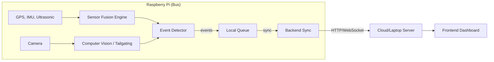

# Rash Driving Detection System - Production Hardware Guide

This guide provides a comprehensive walkthrough for setting up the **IoT Device (Raspberry Pi)** for the Rash Driving Detection System. It covers architecture, hardware assembly (WikiHow style), software installation, and production deployment on a bus.

---

## 🏗️ System Architecture

The IoT device is not just a sensor collector; it is an active **Edge AI** device performing real-time analysis.

### Core Capabilities
1.  **Sensor Fusion (Kalman Filter):** Combines noisy **GPS** speed data with high-frequency **Accelerometer** data to estimate true vehicle state, robust against GPS signal loss (tunnel/urban canyon).
2.  **Computer Vision (Edge AI):** Uses the **Front Camera** to detect **Tailgating** behavior by analyzing the proximity of vehicles ahead.
3.  **Rash Driving Detection:** 
    *   **IMU:** Detects Harsh Braking, Harsh Acceleration, and Aggressive Turns.
    *   **Ultrasonic:** Detects unsafe Close Overtaking on the left side.
4.  **Store & Forward:** If the bus loses internet (4G/WiFi), events are queued locally and synced automatically when connectivity returns.

### Data Flow


---

## 🛒 Hardware Bill of Materials (BOM)

### **Mandatory Components**
| Component | Specification | Purpose | Notes |
|-----------|---------------|---------|-------|
| **Raspberry Pi 4 Model B** | 4GB/8GB RAM | Core Processor | Runs OpenCV & Sensor Fusion. Pi 3 is too slow for CV. |
| **MicroSD Card** | 64GB Class 10 (A2) | Storage | A2 class recommended for video write speeds. |
| **Power Supply** | USB-C, 5V 3A | Power | **Critical:** Must be high quality to prevent undervoltage during CV tasks. |
| **MPU-6050** | GY-521 Module | Accelerometer/Gyro | Detects forces (Braking, Turns). |
| **NEO-6M GPS** | Ublox w/ Antenna | Location/Speed | Place antenna near window. |
| **HC-SR04** | Ultrasonic Sensor | Overtaking Detection | **REQUIRES VOLTAGE DIVIDER.** |
| **Pi Camera Module 3** | Standard/Wide | Tailgating/Evidence | Mount facing forward (road view). |
| **Resistors** | **1kΩ and 2kΩ** | **Safety** | **CRITICAL:** Protects Pi GPIO from 5V Echo. |
| **Power Bank** | 20000mAh PD (18W+) | Bus Power | Ensure it supports "Pass-through charging" if permanently installed. |

---

## 🛠️ WikiHow Style: Step-by-Step Assembly

Follow these steps to build the device.

### **Step 1: Prepare the "Brain" (Raspberry Pi)**
1.  **Install Heatsinks:** Peel and stick heatsinks on the CPU and RAM chips. Video processing generates heat!
2.  **Case:** If using a case, install the fan now. Connect Red wire to Pin 4 (5V) and Black to Pin 6 (GND).

### **Step 2: Wiring the MPU-6050 (The Balance Sensor)**
*   **Goal:** Connect I2C communication.
*   **Wiring:**
    *   **VCC** → Pin 1 (3.3V) *[Check your module, some need 5V Pin 2]*
    *   **GND** → Pin 9 (GND)
    *   **SCL** → Pin 5 (GPIO 3)
    *   **SDA** → Pin 3 (GPIO 2)

### **Step 3: Wiring the GPS (The Navigator)**
*   **Goal:** Connect UART Serial communication.
*   **Wiring:**
    *   **VCC** → Pin 4 (5V)
    *   **GND** → Pin 6 (GND)
    *   **TX** → Pin 10 (GPIO 15 - RXD)
    *   **RX** → Pin 8 (GPIO 14 - TXD)

### **Step 4: Wiring the Ultrasonic Sensor (The Side Eye)**
*   **Goal:** Connect Left-side proximity sensor. **DANGER: 5V LOGIC.**
*   **Wiring:**
    *   **VCC** → Pin 2 (5V)
    *   **GND** → Pin 39 (GND)
    *   **TRIG** → Pin 16 (GPIO 23)
    *   **ECHO** → **STOP! Construct Voltage Divider.**
        *   Connect **ECHO** pin to one end of **1kΩ** resistor.
        *   Connect *other end* of **1kΩ** to **Pin 18 (GPIO 24)**.
        *   *Also* connect that same **Pin 18** point to a **2kΩ** resistor.
        *   Connect the other end of **2kΩ** to **GND**.
    *   *Why? This reduces the 5V return signal to ~3.3V, saving your Pi.*

### **Step 5: Connect the Camera (The Eyes)**
1.  Locate the CSI port (between HDMI and Audio jack / or near USB depending on model).
2.  Lift the plastic clip gently.
3.  Insert ribbon cable (Blue side facing towards USB/Ethernet ports).
4.  Push clip down to lock.

### **Step 6: Mounting on the Bus (Pro Tips)**
*   **Orientation Main Unit:** Mount the Pi flat. The MPU-6050 X-axis arrow should point **FORWARD** (towards driver).
*   **Camera:** Mount on dashboard/windshield facing **FORWARD**.
*   **Ultrasonic:** Mount on the **LEFT** side of the bus (window level), facing **OUTWARD**.
*   **GPS Antenna:** Must have a clear view of the sky (dashboard).

---

## 💻 Software Installation

### 1. OS Setup
1.  Flash **Raspberry Pi OS Lite (64-bit)**.
2.  Enable SSH and setup WiFi during flashing.

### 2. System Dependencies
SSH into the Pi (`ssh pi@rash-pi.local`) and run:
```bash
sudo apt update
sudo apt install -y python3-pip python3-venv git i2c-tools libcamera-apps
# Critical dependencies for OpenCV on Lite OS:
sudo apt install -y libatlas-base-dev libjasper-dev libhdf5-dev libqt5gui5 libqt5test5
```

### 3. Enable Interfaces
```bash
sudo raspi-config
# 1. Interface Options -> I2C -> Yes
# 2. Interface Options -> Serial Port -> Shell=No, Hardware=Yes
# 3. Interface Options -> Camera -> Yes
sudo reboot
```

### 4. Clone & Install
```bash
# On Pi
git clone https://github.com/yourusername/OnboardRash.git # (Or SCP code from laptop)
cd OnboardRash/hardware

python3 -m venv venv
source venv/bin/activate

# Install Python libs
pip install -r requirements.txt
# If requirements.txt is missing, run:
pip install smbus2 pyserial requests python-dotenv opencv-python-headless
```

### 5. Configuration
Create a `.env` file (`nano .env`):
```ini
SERVER_URL=http://<YOUR_LAPTOP_IP>:5000
API_KEY=default-secure-key-123
BUS_REGISTRATION=KL-01-AB-1234
ENABLE_CAMERA=true
```

---

## 🚀 Production Deployment (Auto-Start)

To make the system start automatically when the bus turns on (Production Ready).

1.  **Create a Service File:**
    ```bash
    sudo nano /etc/systemd/system/rash-detection.service
    ```

2.  **Add Content:**
    ```ini
    [Unit]
    Description=Rash Driving Detection Service
    After=network.target

    [Service]
    User=pi
    WorkingDirectory=/home/pi/OnboardRash/hardware
    ExecStart=/home/pi/OnboardRash/hardware/venv/bin/python main_pi.py
    Restart=always
    RestartSec=10

    [Install]
    WantedBy=multi-user.target
    ```

3.  **Enable & Start:**
    ```bash
    sudo systemctl daemon-reload
    sudo systemctl enable rash-detection.service
    sudo systemctl start rash-detection.service
    ```

4.  **Check Status:**
    ```bash
    sudo systemctl status rash-detection.service
    ```

---

## 🔧 Troubleshooting

| Issue | Solution |
|-------|----------|
| **Camera Error** | Run `libcamera-hello` to test. If "No cameras available", check ribbon cable direction. |
| **I2C Error** | Run `i2cdetect -y 1`. You should see `68` (MPU). If not, check wiring (SDA/SCL swapped?). |
| **No GPS Fix** | GPS needs "Cold Start" (5-10 mins outside). LED will blink when fixed. |
| **Overtake Falses**| Ultrasonic sensor might be seeing the ground. Angle it slightly upward or mount higher. |
