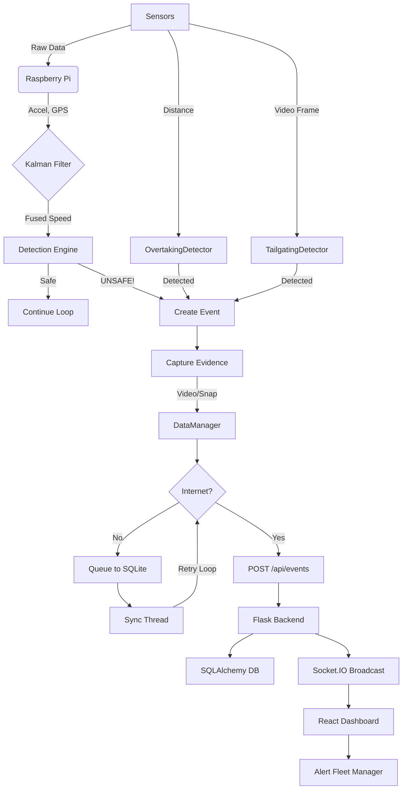

# System Workflow & Scenarios

This document outlines how the **OnboardRash - Rash Driving Detection System** behaves in different real-world conditions, explaining the flow of data from sensors to the dashboard.

---

## Architecture Overview

```
+-------------------+          +------------------+          +------------------+
|   Raspberry Pi    |  HTTP    |   Flask Backend  |  Socket  |  React Frontend  |
|                   | -------> |                  | <------> |                  |
| - Sensor Fusion   |          | - REST API       |          | - Zustand Store  |
| - DataManager     |          | - SQLAlchemy     |          | - TailwindCSS    |
| - Event Detection |          | - Socket.IO      |          | - Real-time UI   |
+-------------------+          +------------------+          +------------------+
```

---

## Scenario 1: Normal Driving
*Condition: Bus is moving smoothly on a highway.*

1.  **Sensors**:
    *   **IMU**: Reads low acceleration values (< 0.5g).
    *   **GPS**: specific lat/long, Speed = 60 km/h.
    *   **Kalman Filter**: Fuses data, outputting a smooth 60 km/h.
    *   **Camera**: Capturing frames to buffer (rolling 5s), but discarding old ones.
2.  **Logic**:
    *   RashDrivingDetector: Checks thresholds → All Safe.
    *   TailgatingDetector: Front vehicle > 10m away (< 5% frame) → Safe.
    *   OvertakingDetector: Side clear → Safe.
3.  **Action**:
    *   No "Events" created.
    *   **Dashboard**: Shows green status, live location updates on map via periodic location POST.

---

## Scenario 2: Harsh Braking (Event)
*Condition: Driver slams brakes to avoid a dog.*

1.  **Sensors**:
    *   **IMU**: Detects sharp deceleration ($X < -1.5g$).
    *   Kalman Filter handles vibration noise.
2.  **Logic**:
    *   `RashDrivingDetector.analyze()` triggers `HARSH_BRAKE` event.
    *   Severity calculated based on G-force (e.g., -1.9g = **HIGH** severity).
    *   5-second cooldown prevents duplicate events.
3.  **Evidence Capture**:
    *   **Camera**: saves video clip (previous 5s buffer + next 5s) → `HARSH_BRAKE_...mp4`.
    *   **Snapshot**: Captures immediate JPEG.
4.  **Transmission**:
    *   `DataManager.queue_event()` called.
    *   **Online**: Event JSON uploaded immediately to `/api/events`. Media uploaded to `/api/events/{id}/snapshot`.
    *   **Dashboard**: Receives Socket.IO `new_alert` event, shows toast notification and plays audio alert for HIGH severity.

---

## Scenario 3: Tailgating (Driver Fault)
*Condition: Bus driver gets too close (2m) to a car in front.*

1.  **Sensors**:
    *   **Front Camera**: Vehicle fills the view.
2.  **Logic**:
    *   **TailgatingDetector**: Uses Haar cascade (`haarcascade_car.xml`) or contour detection.
    *   Calculates vehicle Area = 20% of frame.
    *   **Night Mode**: If dark, Gamma Correction boosts brightness to see car outline.
    *   Logic: `Area > 15%` sustained for `MIN_DETECTION_FRAMES` (5) → **TAILGATING DETECTED**.
3.  **Action**:
    *   Alert queued via DataManager and sent to backend.
    *   Dashboard shows "Tailgating" violation with event details.

---

## Scenario 4: Close Overtaking (Traffic Logic)
*Condition: A motorbike squeezes between the bus and median.*

1.  **Sensors**:
    *   **Left Ultrasonic (HC-SR04)**: Distance drops to 80cm (< 1m).
    *   **GPS/Kalman Filter**: Fused Speed = 45 km/h.
2.  **Logic**:
    *   **OvertakingDetector**:
        *   Is Speed > 10 km/h? **YES** (Valid motion).
        *   Is Distance < 100 cm? **YES** (Danger zone).
        *   Is Duration > 0.5s? **YES** (Real vehicle, not a pole).
    *   Result: `CLOSE_OVERTAKING` Event with MEDIUM severity.
3.  **Action**:
    *   Event logged with GPS coordinates. Fleet manager sees dangerous overtake hotspots.

---

## Scenario 5: Loss of Internet (Offline Mode)
*Condition: Bus enters a remote area with no 4G signal.*

1.  **Event Occurs**: e.g., Aggressive Turn detected.
2.  **Transmission Failure**:
    *   `requests.post` fails (Connection Error/Timeout).
3.  **DataManager**:
    *   Catches error in `_upload_event()`.
    *   **Queues Event**: Saves JSON payload + video/snapshot paths to local SQLite (`events_queue.db`).
4.  **Recovery**:
    *   Bus re-enters city (4G returns).
    *   `DataManager._sync_loop()` background thread detects connectivity.
    *   **Auto-Upload**: Pushes all queued events to server in FIFO order.
    *   Successful events removed from local queue.
    *   **Dashboard**: Receives backlogged events with original timestamps.

---

## Data Flow Summary



---

## Backend API Flow

1. **Event Reception** (`POST /api/events`):
   - Validate API key header
   - Process event data via `process_event_data()`
   - Store in SQLAlchemy `DrivingEvent` model
   - Update `BusLocation` if location provided
   - Broadcast via `socketio.emit('new_alert', event_dict)`

2. **Media Upload** (`POST /api/events/{id}/snapshot`):
   - Accept multipart file or base64 JSON
   - Save to `uploads/` directory
   - Update event record with `snapshot_url`

3. **Dashboard Fetch** (`GET /api/events`, `/api/buses/locations`):
   - Query with filters (severity, type, date range)
   - Return paginated JSON results
   - Frontend polls locations every 10s

---

## Frontend State Management

- **Zustand Stores**:
  - `useBusStore`: Fleet data and locations
  - `useEventStore`: Events list and filters
  - `useUIStore`: UI state (sidebar, modals)

- **Real-time Updates**:
  - Socket.IO client connects on app mount
  - `new_alert` events trigger toast notifications
  - High severity events play audio alert (Howler.js)

---

## Key Configuration (Environment Variables)

| Variable | Default | Description |
|----------|---------|-------------|
| `SERVER_URL` | `http://localhost:5000` | Backend API URL |
| `API_KEY` | `default-secure-key-123` | API authentication key |
| `BUS_REGISTRATION` | `KL-01-TEST-001` | Bus identifier |
| `SAMPLE_RATE` | `0.1` | Sensor read interval (10Hz) |
| `ENABLE_CAMERA` | `true` | Enable camera module |
