# System Workflow & Scenarios

This document describes how the **OnboardRash - Rash Driving Detection System** behaves across the full 4-node architecture, including the new Driver Companion App.

---

## Architecture Overview

```
  ┌─────────────────┐   WiFi Hotspot (2Hz GPS POST)  ┌──────────────────────┐
  │  Driver's Phone  │◄──────────────────────────────►│   Raspberry Pi        │
  │  (Expo App)      │   http://192.168.43.1:8081      │   (Bus Hardware)      │
  │                  │                                 │                       │
  │ expo-location    │                                 │ PhoneGPSReceiver :8081│
  │ GPS Stream       │                                 │ IMU, Ultrasonic, Cam  │
  │ Trip Management  │                                 │ DataManager (S&F)     │
  └────────┬─────────┘                                 └──────────┬────────────┘
           │                                                      │
           │  Both connect to backend via                         │
           │  phone's hotspot internet                            │
           │                                                      │
           ▼                                                      ▼
  ┌─────────────────────────────────────────────────────────────────────────────┐
  │                        Flask Backend  :5000                                 │
  │                                                                             │
  │  /api/drivers  ←── Driver app (auth, trips, events)                         │
  │  /api/events   ←── Pi (HARSH_BRAKE, TAILGATING, etc.)                       │
  │  /api/buses    ←── Pi (bus registration on startup)                         │
  │  WebSocket     ──► React dashboard (live alerts, bus locations)              │
  └──────────────────────────────┬──────────────────────────────────────────────┘
                                 │
                                 │ Browser
                                 ▼
                        ┌─────────────────┐
                        │  React Frontend  │
                        │  localhost:5173  │
                        │                 │
                        │  Live Map       │
                        │  Events Table   │
                        │  Dashboard      │
                        └─────────────────┘
```

---

## Node Responsibilities

| Node | Runs On | Responsibility |
|---|---|---|
| **Raspberry Pi** | Pi on the bus | Detects rash events via IMU/Ultrasonic/Camera. Receives GPS from phone's app. Sends events to backend via phone's internet. |
| **Driver's Phone** | Android/iOS | Streams GPS to Pi at 2Hz. Provides internet access to Pi via WiFi hotspot. Lets driver manage trips and view their score. |
| **Flask Backend** | Laptop/Server | Central API. Stores all events, buses, drivers, trips in SQLite. Broadcasts real-time alerts via WebSocket. |
| **React Dashboard** | Browser | Operations team view. Live bus map, event feed, alerts with audio. |

---

## Scenario 1: Driver Starts a Shift

*Condition: Driver arrives at the bus depot.*

1. **Driver** opens the Expo app → logs in → taps **Start Trip**.
2. **App** calls `POST /api/drivers/me/trip/start` → backend creates a `Trip` record.
3. **App** requests location permission and starts `expo-location` background task.
4. **GPS Stream** begins: every 500ms, app POSTs `{ lat, lng, speed, heading }` to `http://192.168.43.1:8081/gps`.
5. **Raspberry Pi** receives GPS data via `PhoneGPSReceiver` — identical interface to hardware NEO-6M GPS.
6. **Pi** uses the phone as both internet gateway (via hotspot) and GPS source.

---

## Scenario 2: Normal Driving

*Condition: Bus moving smoothly at 60 km/h.*

1. **IMU**: Low acceleration (< 0.5g). **Phone GPS**: lat/lng + 60 km/h.
2. **Kalman Filter**: Fuses IMU acceleration + phone GPS speed → smooth 60 km/h.
3. **RashDrivingDetector**: All thresholds safe → no event.
4. **Pi**: POSTs current bus location to `/api/buses/locations` periodically.
5. **Dashboard**: Shows green bus marker on live map, no alerts.

---

## Scenario 3: Harsh Braking (Event Detected)

*Condition: Driver slams brakes.*

1. **IMU**: Sharp deceleration X < -1.5g.
2. **Kalman Filter** smooths out vibration noise; sustained deceleration confirmed.
3. **RashDrivingDetector**: Triggers `HARSH_BRAKE`. Severity: `HIGH` if X < -1.8g.
4. **Evidence**: Camera saves 5s pre-event + 5s post-event clip. Snapshot captured.
5. **DataManager.queue_event()**: Uploads immediately to `POST /api/events`.
6. **Backend**: Saves event, broadcasts `new_alert` via Socket.IO.
7. **Driver App**: Polls `/api/drivers/me/events` every 5s → shows alert with **red severity glow**.
8. **Dashboard**: Receives WebSocket event → shows toast + audio alert.
9. **Trip Score**: Decreases by 15 points (HIGH penalty).

---

## Scenario 4: Harsh Acceleration

*Condition: Driver stomps gas at a green light.*

1. **IMU**: X > 1.0g forward.
2. `HARSH_ACCEL` event, `MEDIUM` severity.
3. Logged and broadcast. **Trip Score** decreases by 8 points.

---

## Scenario 5: Tailgating

*Condition: Bus too close to vehicle ahead.*

1. **Front Camera**: Vehicle area > 15% of frame for 5+ consecutive frames.
2. `TAILGATING` event triggered. Evidence snapshot captured.
3. Event sent to backend, appears on dashboard and driver app.

---

## Scenario 6: Close Overtaking

*Condition: Motorbike squeezes on left side.*

1. **HC-SR04 Ultrasonic** (left side): Distance < 100cm.
2. **PhoneGPS speed** (via Kalman): > 10 km/h (vehicle moving, not parked).
3. Duration > 0.5s (real vehicle, not a pole).
4. `CLOSE_OVERTAKING` event, `MEDIUM` severity. GPS coordinates logged.

---

## Scenario 7: Phone Hotspot Drops (Offline Mode)

*Condition: Driver's hotspot disconnects momentarily.*

1. Pi's `DataManager._upload_event()` fails (ConnectionError).
2. Event queued to local SQLite (`events_queue.db`).
3. `_sync_loop()` background thread retries every 5 seconds.
4. When hotspot reconnects → events uploaded automatically in FIFO order.
5. Dashboard receives backlogged events with original timestamps.

---

## Scenario 8: Driver Ends Shift

1. Driver taps **End Trip** in app.
2. App calls `POST /api/drivers/me/trip/stop`.
3. Background GPS task stops (foreground service notification disappears).
4. **Backend** counts all events during the trip, calculates final score (start 100 → subtract per event severity), stores on `Trip` record.
5. App shows final score + event count summary.

---

## Full Data Flow Diagram

```mermaid
graph TD
    Phone["📱 Driver's Phone\n(Expo App)"] -->|"GPS POST @2Hz\nhttp://pi:8081/gps"| Pi["🖥️ Raspberry Pi"]
    Phone -->|"Trip start/stop\nauth, events\nPOST /api/drivers"| Backend["☁️ Flask Backend\n:5000"]

    subgraph "Raspberry Pi (Bus Edge)"
        Pi --> PGps["PhoneGPSReceiver\n:8081"]
        Pi --> IMU["MPU-6050\nIMU Sensor"]
        Pi --> Ultra["HC-SR04\nUltrasonic"]
        Pi --> Cam["USB Webcam\n(Front)"]
        PGps & IMU --> Fusion["Kalman Filter\nSensor Fusion"]
        Fusion --> Detect["RashDrivingDetector"]
        Ultra --> OD["OvertakingDetector"]
        Cam --> TD["TailgatingDetector"]
        Detect & OD & TD -->|"event"| DM["DataManager\nStore & Forward"]
    end

    DM -->|"POST /api/events\nvia hotspot internet"| Backend

    Backend --> DB["SQLite DB\nEvents, Buses,\nDrivers, Trips"]
    Backend -->|"Socket.IO new_alert"| Dashboard["🖥️ React Dashboard\nlocalhost:5173"]
    Backend -->|"GET /api/drivers/me/events"| Phone
```



---

## Backend API Reference

| Method | Endpoint | Caller | Purpose |
|---|---|---|---|
| `POST` | `/api/events` | Pi | Log a rash driving event |
| `POST` | `/api/events/{id}/snapshot` | Pi | Upload video/snapshot |
| `GET` | `/api/events` | Dashboard | Fetch event list with filters |
| `GET` | `/api/buses/locations` | Dashboard | Live bus positions (map) |
| `POST` | `/api/buses` | Pi | Register bus on startup |
| `POST` | `/api/drivers/register` | Driver App | Create driver account |
| `POST` | `/api/drivers/login` | Driver App | Authenticate driver |
| `GET` | `/api/drivers/me` | Driver App | Profile + stats |
| `POST` | `/api/drivers/me/trip/start` | Driver App | Start a trip |
| `POST` | `/api/drivers/me/trip/stop` | Driver App | End trip, finalize score |
| `GET` | `/api/drivers/me/events` | Driver App | Events during active trip |
| `GET` | `/api/drivers/me/trips` | Driver App | Trip history |

---

## Key Configuration (Environment Variables)

### hardware/.env (Raspberry Pi)
| Variable | Default | Description |
|---|---|---|
| `SERVER_URL` | `http://192.168.1.40:5000` | Backend URL (via phone hotspot) |
| `API_KEY` | `default-secure-key-123` | API authentication key |
| `BUS_REGISTRATION` | `KL-01-AB-1234` | Bus identifier |
| `SAMPLE_RATE` | `0.1` | Sensor read interval (10Hz) |
| `ENABLE_CAMERA` | `true` | Enable camera module |
| `GPS_SOURCE` | `phone` | `phone` or `hardware` (NEO-6M) |
| `PHONE_GPS_PORT` | `8081` | Port for PhoneGPSReceiver |

### Driver App (Profile → Settings)
| Setting | Default | Description |
|---|---|---|
| Pi Address | `http://192.168.43.1:8081` | Pi's GPS receiver endpoint |
| Backend Server | `http://192.168.1.40:5000` | Flask backend |

### Frontend / Backend
| Variable | Description |
|---|---|
| `VITE_API_URL` | Backend URL for React frontend |
| `FLASK_ENV` | `development` or `production` |
