# System Workflow & Scenarios 🚌

This document outlines how the **Rash Driving Detection System** behaves in different real-world conditions, explaining the flow of data from sensors to the dashboard.

---

## 🟢 Scenario 1: Normal Driving
*Condition: Bus is moving smoothly on a highway.*

1.  **Sensors**:
    *   **IMU**: Reads low acceleration values (< 0.5g).
    *   **GPS**: specific lat/long, Speed = 60 km/h.
    *   **Kalman Filter**: Fuses data, outputting a smooth 60 km/h.
    *   **Camera**: Capturing frames to buffer (rolling 5s), but discarding old ones.
2.  **Logic**:
    *   Rash Detector: Checks thresholds → All Safe.
    *   Tailgating: Front vehicle > 10m away (< 5% frame) → Safe.
    *   Overtaking: Side clear → Safe.
3.  **Action**:
    *   No "Events" created.
    *   **Dashboard**: Shows green status, live location updates on map.

---

## 🔴 Scenario 2: Harsh Braking (Event)
*Condition: Driver slams brakes to avoid a dog.*

1.  **Sensors**:
    *   **IMU**: Detects sharp deceleration ($X < -1.5g$).
2.  **Logic**:
    *   `RashDrivingDetector` triggers `HARSH_BRAKE` event.
    *   Severity calculated based on G-force (e.g., -1.9g = **HIGH** severity).
3.  **Evidence Capture**:
    *   **Camera**: saves video clip (previous 5s buffer + next 5s) → `HARSH_BRAKE_...mp4`.
    *   **Snapshot**: Captures immediate JPEG.
4.  **Transmission**:
    *   `send_event()` called.
    *   **Online**: Uploads JSON + Snapshot immediately. Video uploads in background.
    *   **Dashboard**: Turns **RED**, plays alert sound, shows "Harsh Braking" on map.

---

## 🟡 Scenario 3: Tailgating (Driver Fault)
*Condition: Bus driver gets too close (2m) to a car in front.*

1.  **Sensors**:
    *   **Front Camera**: See vehicle filling the view.
2.  **Logic**:
    *   **Computer Vision**: Detects vehicle shape. Calculates Area = 20% of frame.
    *   **Night Mode**: If dark, Gamma Correction boosts brightness to see car outline.
    *   Logic: `Area > 15%` → **TAILGATING DETECTED**.
3.  **Action**:
    *   Alert sent to backend.
    *   Dashboard logs "Tailgating" violation. Driver profile score decreases.

---

## ⚠️ Scenario 4: Close Overtaking (Traffic Logic)
*Condition: A motorbike squeezes between the bus and median.*

1.  **Sensors**:
    *   **Left Ultrasonic**: Distance drops to 80cm (< 1m).
    *   **GPS/Fusion**: Speed = 45 km/h.
2.  **Logic**:
    *   **Traffic Filter**: 
        *   Is Speed > 10 km/h? **YES** (Valid).
        *   Is Distance < 100 cm? **YES** (Danger).
        *   Is Duration > 0.5s? **YES** (Real vehicle, not a pole).
    *   Result: `CLOSE_OVERTAKING` Event.
3.  **Action**:
    *   Logs dangerous overtake. Fleet manager sees where unsafe passes happen often.

---

## 📶 Scenario 5: Loss of Internet (Offline Mode)
*Condition: Bus enters a remote area with no 4G signal.*

1.  **Event Occurs**: e.g., Aggressive Turn.
2.  **Transmission Failure**:
    *   `requests.post` fails (Connection Error).
3.  **Data Manager**:
    *   Catches error.
    *   **Queues Event**: Saves JSON + Video Path to local `sqlite` database.
4.  **Recovery**:
    *   Bus re-enters city (4G returns).
    *   `DataManager` sync thread detects connection.
    *   **Auto-Upload**: Pushes all queued events to server.
    *   **Dashboard**: Suddenly populates with missing events from the last hour.

---

## ⚡ System Flowchart

```mermaid
graph TD
    A[Sensors] -->|Raw Data| B(Raspberry Pi)
    B -->|Accel, GPS| C{Kalman Filter}
    C -->|True Speed| D[Logic Engine]
    
    A -->|Distance| D
    A -->|Video Frame| D
    
    D -->|Safe| E[Loop Continue]
    D -->|UNSAFE!| F[Trigger Event]
    
    F --> G[Capture Evidence]
    G -->|Video/Snap| H{Internet?}
    
    H -- Yes --> I[Upload to Server]
    H -- No --> J[Save to Local DB]
    
    J --> K[Sync Service]
    K -->|Retry| H
    
    I --> L[Web Dashboard]
    L --> M[Alert Fleet Manager 🚨]
```

